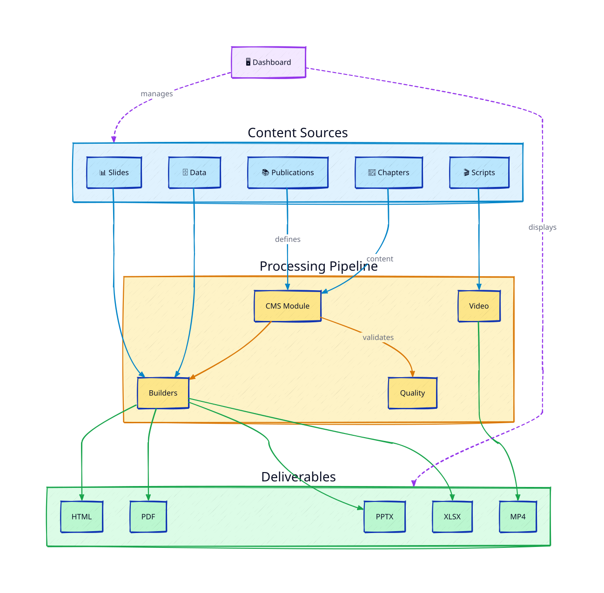
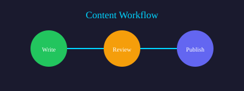

# Introduction to Media Engine

Media Engine is a powerful, agent-operated media production framework designed to transform structured content into professional outputs. Whether you need documents, presentations, videos, or data exports, Media Engine provides a unified workflow that AI assistants like Claude Code can operate autonomously—turning your Markdown source files into polished deliverables with minimal manual intervention.

## Key Features

- **Content Management**: Markdown documents with YAML frontmatter for metadata tracking
- **Multi-format Output**: Generate HTML, PDF, PPTX, XLSX, and video from the same source
- **Smart Caching**: Only rebuild what's changed
- **Multi-language Support**: Content in multiple languages with translation tracking
- **Agent-Friendly**: CLI designed for AI assistants to operate

## How It Works

```
Content (Markdown) → Media Engine → Outputs (PDF, Video, etc.)
                          ↑
                    project.yaml
                    (configuration)
```



The media engine reads your content, applies your theme, and generates outputs. It tracks what's been built and only regenerates when source content changes.



## Getting Started

1. Create a project with `media-engine init`
2. Add content to `content/{language}/chapters/`
3. Build with `media-engine build`
4. Publish to Desktop with `media-engine publish`

## Feature Overview

| Category | Capabilities |
|----------|-------------|
| **Content** | Markdown with frontmatter, multi-language support, translation tracking |
| **Outputs** | HTML, PDF, PPTX, XLSX, video generation |
| **Quality** | Readability scoring, link validation, security scanning |
| **Workflow** | Smart caching, dependency tracking, approval workflows |
| **Integration** | CLI for automation, MCP server for AI agents, web dashboard |
